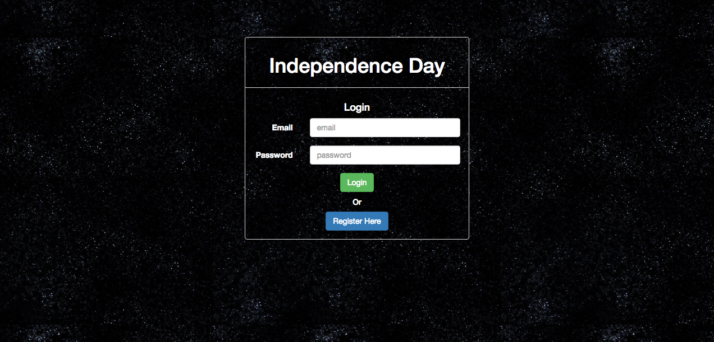
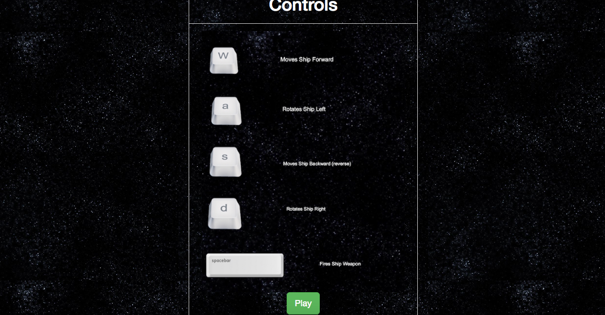
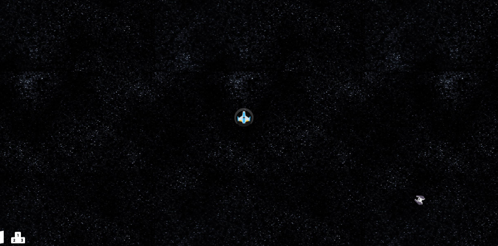

# Independence-Day
#### A Free roam, space shooting time trial. Play, as the one and only Russell Casse(Randy Quaid) as he attempts to take down the mothership!

### Technologies Utilized
---
  - Phaser.io
  - AngularJS
  - Firebase
  - Physics Editor
  - Bootstrap

#### How to play:
---
[Think you have what it takes? Click here to play.](https://benwilburn.com/independence-Day-Capstone)

#### Gameplay:
---
Fly around the map and kill all the ememies in each wave to reach the Boss Wave. You have some wiggle room, with a fully powered shield and 100% health to start the game. Don't take too many hits though! If you do you'll pay the price. Once you get to the Boss round, all luck to you. I won't spoil the secret! Ah, and lastly if you need a pick me up on health or shields just pick up the green and white pill! Lowest time is the highest score(obviously).

#### Screenshots:
---




WASD Keys for movement:
- w = forward
- a = pan Left
- s = backward
- d = pan right

If you have a PS4 controller or select Xbox One controllers, you can use that to play.
- Right Trigger = Fire Weapon
- Left Thumbstick = Forward/Backward
- Right Thumbstick = Pan Left/Right



### Installation
---
In your terminal run:
If you are using HTTPS:
```sh
$ git clone [https://github.com/benwilburn/Independence-Day-Capstone.git]
```
If your are using SSH:
$ git clone [git@github.com:benwilburn/Independence-Day-Capstone.git]

Run in the root of the project:
```sh
$ bower install
```

### License
---

MIT
